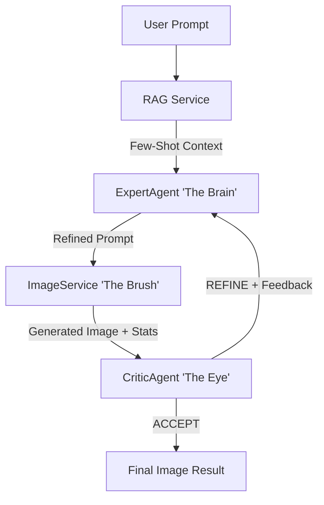

<div align="center">

# 🎨 IRG: Iterative Reasoning-Generation
### *The Autonomous Multi-Agent Framework for Self-Correcting Image Synthesis*

**Standard T2I models are static. IRG is dynamic. It thinks, critiques, and refines until perfection.**

[](https://huggingface.co/spaces)
[](https://www.python.org/)
[](https://fastapi.tiangolo.com/)
[](https://ai.google.dev/)
[](https://stability.ai/)

<br>

https://github.com/user-attachments/assets/PLACEHOLDER_VIDEO_ID

*(Watch IRG autonomously diagnose and fix lighting/composition issues in real-time)*

[**Showcase**](#-real-world-case-studies) • [**How it Works**](#️-system-architecture) • [**Quickstart**](#-installation--setup) • [**Research**](#-research-foundation)

</div>

---

## 💡 The Value Proposition

**The Problem:** Modern Text-to-Image (T2I) systems are "one-shot" black boxes. Users must manually guess new prompts when the output fails to match their intent or suffers from technical artifacts (overexposure, poor binding).

**The Solution:** **IRG** introduces a **closed-loop feedback system**. Inspired by human artistic workflows, it employs a multi-agent hierarchy to perform autonomous **Think → Generate → Critique → Refine** cycles.

### 🚀 Impact at a Glance
- ⚡ **Zero-Manual Prompting**: Describe once; let the agents handle the refinement.
- 🎯 **Technical Precision**: Automatically fixes `Blown-Highs`, `Low-Contrast`, and `Semantic Drift`.
- 🧠 **Context Awareness**: Uses RAG (Retrieval-Augmented Generation) to learn from the best historical prompt-engineering patterns.

---

## 🎬 Real-World Case Studies

IRG doesn't just generate images; it **reasons** about them. Below is the technical breakdown of an autonomous session.

### 🏙️ Case study 01: Cyberpunk Metropolis
> **Initial Prompt:** *"futuristic cyberpunk city at night, neon reflections on wet streets"*

| Stage | Action | Technical Outcome |
| :--- | :--- | :--- |
| **Initial (Iter 0)** | Zero-shot generation | Initial composition established. |
| **Refinement (Iter 1)** | **Expert-Agent diagnosis** | Detected `Max: 0.9935` (Blown Highlights). Added luminosity constraints. |
| **Optimization (Iter 2)** | **Critic-Agent feedback** | Highlight roll-off attenuation to prevent clipping. |
| **Final (Iter 3)** | **Success ✅** | Balanced HDR output with rich contrast and cinematic atmosphere. |

### 🐱 Case study 02: Macro Portrait (Ginger Cat)
> **Refinement Logic:** The system detected pixel-level saturation on white fur and autonomously adjusted the *White Point* (-8%) while maintaining mid-tone depth.

---

## 🏗️ System Architecture

IRG is powered by a sophisticated multi-agent orchestrator:



1.  **ExpertAgent (Gemini 2.0)**: Acts as the Art Director. It translates mathematical image statistics into actionable prompt engineering.
2.  **ImageService (SDXL 1.0)**: The execution layer, performing both `Text-to-Image` and `Image-to-Image` refinements.
3.  **CriticAgent (Gemini 2.0)**: The Quality Gate. It utilizes NumPy-derived statistical thresholds (mean, std, max) to decide if an image meets production standards.
4.  **RAG Service**: Provides the "Collective Memory", retrieving high-performing prompt structures from a vector database.

---

## 📦 Installation & Setup

IRG is built for high-performance production environments.

### 🐳 Option 1: Docker Compose (Recommended)
```bash
git clone https://github.com/dungna13/iterative-image-refinement.git
cd iterative-image-refinement
cp .env.example .env # Add your GEMINI_API_KEY and STABILITY_API_KEY
docker compose up
```

### 🐍 Option 2: Local Python Environment
```bash
pip install -r requirements.txt
pip install gradio # For Web UI
python app_gradio.py
```

---

## 🔌 API Reference

### `POST /refine`
Autonomous image refinement endpoint.

**Request Body:**
```json
{
  "prompt": "a medieval knight fighting a dragon",
  "iterations": 3
}
```

**Key Response Fields:**
- `total_iterations`: Number of cycles performed before early-stopping.
- `iterations_summary`: Full audit trail of issue diagnosis and actions taken.

---

## 🔬 Research Foundation

IRG began as an academic thesis investigating the intersection of **Compositional Reasoning** and **Small-Parameter LLMs**.

### Phase 1 Results (Fine-tuned Qwen-2.5-3B)
- **Compositional Accuracy**: +7.74% improvement over baseline SDXL.
- **Aesthetic Score**: +3.08% improvement.
- **Innovation**: Realized via LoRA fine-tuning on 4,000 synthetic reasoning traces.

---

## 🛠️ Tech Stack

- **Core**: Python 3.11, FastAPI
- **LLM**: Google Gemini 2.0 Flash Lite (Cost-Efficient Agentic Inference)
- **T2I Model**: Stability AI SDXL 1.0
- **Vector Search**: `sentence-transformers` (all-MiniLM-L6-v2)
- **Frontend**: Gradio (Interactive Playground)

---

## 📜 License & Acknowledgments

- Licensed under **CC BY-NC 4.0** (Non-Commercial Research).
- Copyright © 2025 **Anh-Dung Ngo**.

<div align="center">

**[⭐ Star this repository if you find IRG useful for your AI workflow!]**

</div>
